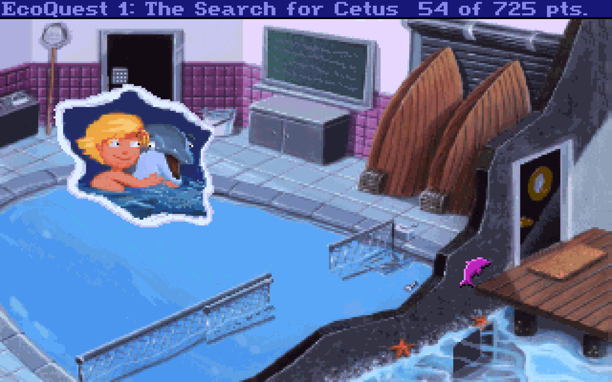
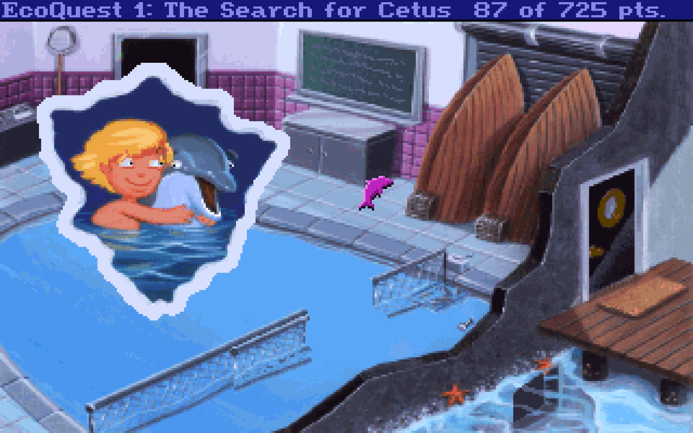
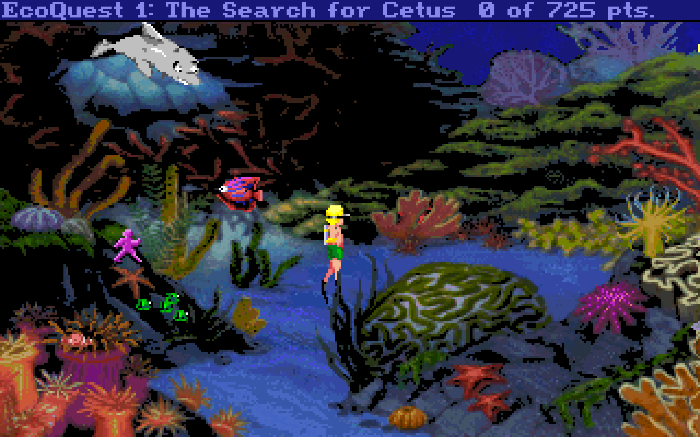
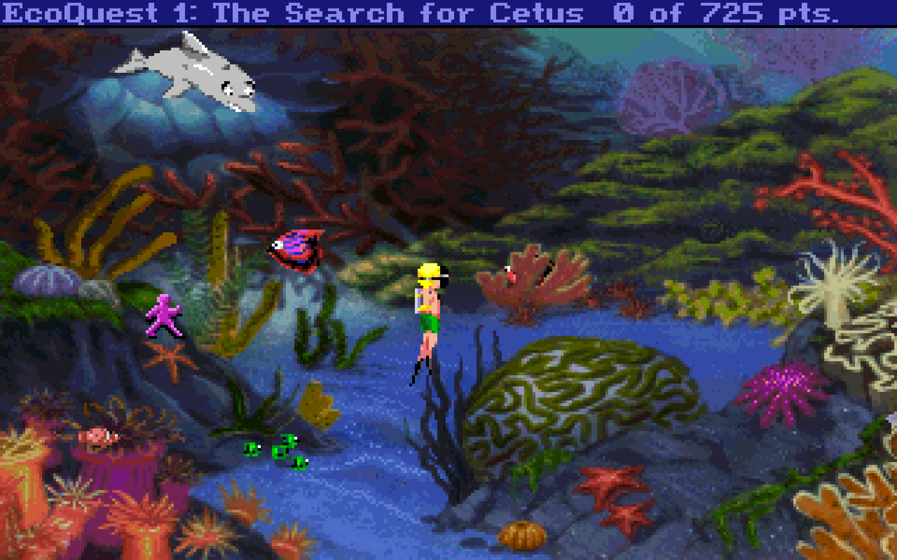
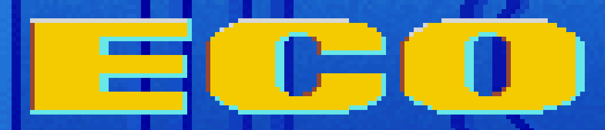
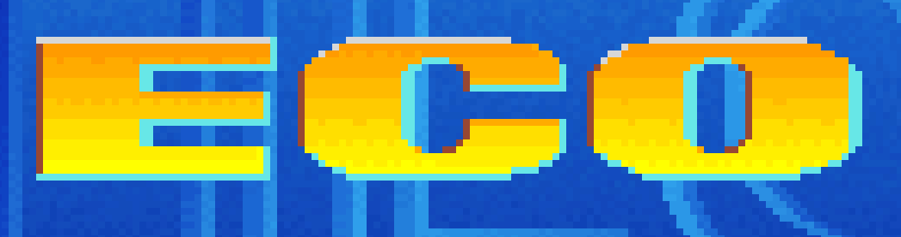

# EcoQuest 1 - CD Recycled

EcoQuest 1 is a beautiful game. The undersea kingdom of Eluria is a sight to behold, even by today's standards.

Unfortuanatly, all retail versions of the game have bugs and graphical issues. While the CD (talkie) version added some amazing voice work to the game, the artwork is objectivly worse compared to the original Floppy Disk version. For whatever reason, the CD graphics in many cases were scaled-down or altered in undesirable ways. 

This fan patch for EQ1CD restores the glory of the original artwork, fixes the many bugs & transition issues, and attempts to create the best possible EQ1 player experience. 

An example of the scaled down art in the retail CD version:

</img>

Restored full-size art in the EQ1-CDR patch:

</img>

Issues with the CD version's palettes often ruin the background art:

</img>

Restored background in the EQ1-CDR patch:

</img>

### Highlights

- All known bugs and broken messages fixed.

- Restored backgrounds and views from the floppy version.

- Palette and transition issues fixed.

- Restored several unused messages and fish.

- Several Animation fixes and improvements.

- Copy protection restored (RTFM).

- A new anachronistic Easter Egg to discover.

### Installation 

Place the "patch" folder in your EcoQuest 1 game folder and start normally. DOSBox users must add the following line to the end of the RESOURCE.CFG file found in the base game directory: 

<code>patchDir = patch</code>

This patch is for the CD (talkie) version only. You can verify the patch is active by checking the title screen. The Retail CD version has a solid yellow "Eco":

</img>

The EQ1-CDR patch uses the gradient logo from the floppy version:

</img>

### Uninstall

Delete the "patch" folder from your EQ1CD game folder.

### Background

This project is a colaboration with my dear friend Threepwang as part of his French translation. This patch wouldn't be possilbe without his hard work and dedication to the project.

"Threepwang and DL at Eluria! Threepwang and DL on the water."

### Changes

Thanks to Threepwang for tracking the changes! 

61.SCR & HEP
140.SCR & HEP
142.SCR & HEP
380.SCR & HEP
381.SCR & HEP
Official Sierra patches, present in the root of the CD-ROM.
*In blue, patches modified for debugging purposes.

5.SCR
Allows to correct the missing sentence in the inventory,
Clicking on the tweezers. Msg 3, line 86: "Twang!
Also allows to correct in msg 5, lines 4, 10, 22 and 23 according to the combination
of the 3 elements that make up the sonar buoy, namely: "The buoy, the cable and the transmitter".
Also allows you to centre the yellow frame under the inventory which contains the icons:
"Eye", "hand", "arrow", "question mark" and "OK".

59.SCR & HEP
Talk script.
It controls everything when Adam enters the pool with Del until he gets out to throw the frisbee.
Fixed a bug when the player clicks very quickly and repeatedly on Del's fin.
on Del's fin to spin Adam around in the pool. Adam was disappearing from the screen until he exited the pool.

61.SCR & HEP
ThrowFrisbee script.
Original Sierra corrections, modified for Del's receiving the frisbee.
+
395.V56
Correction for Del's cut nose at the moment of receiving the frisbee with the sentence: "I got it".
+
380.SCR & HEP & 381.SCR & HEP
Original Sierra patches, modified mainly to achieve a screen transition "dissolve to black"
screen transition between the lab and the flawless palette pool, as described below for specific fixes to palette issues.
Minor code changes to fix frisbee reception issues.
Relocalized line 137 of msg 380 if the player clicks on the frisbee on the cupboard,
while Adam is still in the pool. Specifically, the 381.scr is used to center the interlude in msg 380, line 159:
"Days pass...", as indicated in below.

66.SCR
Fix animation issue when cleaning bird.

70.scr
Fix missing line in room400 "adam picks up the gerbil's full water bottle".

221.SCR
Corrects the 221 msg, it allows to see line 53, instead of line 32.

225.SCR
Correction for the inventory bug at Gregorious.
Now if the player uses the "hand" icon on the jar or shell in the inventory, there is no longer an error message.

227.SCR
Corrected at Gregorious for the 3 lines of text that appear illogically,
if the player takes an item from his inventory and clicks on the floor with the item,
such as screws. Concerns msg 4, lines 35, 36 and 37.

300.SCR
Corrected msg 300 to show line 17 instead of line 16. This was a text location bug.

381.SCR
Completes the "ThrowFrisbee" script.

500.MAP & 500.MSG
Corrected 500 msg, 500 peak with goldfish.
Dubbing bug with error messages on lines 27 and 28.
Now if the player places the "eye" icon on the red fish in his escape, the text and dubbing are correct.
*Since I couldn't change message 01 00 01 13 --> 04 00 01 13,
I simply change 04 --> 01 in 500.map and 500.msg. 

521.SCR
Correction to allow hammerhead to continue swimming,
even during text bubbles as in the floppy version.

561.SCR
Fixed to change the dubbing and text in the 561 peak cave.
When the player used the "eye" icon on the phosphorescent mosses on the ground.
He would get the sentence and dubbing corresponding to msg 561 line 2:
"The spine carries a natural poison - but it won't cancel out the chemical poisons found here."
This was a bug, the correct sentence is msg 560 line 7: "Weirdly glowing algae has mutated out of the toxic soup."
The sentence with the poison occurs if the player uses the lionfish spine on the toxic barrels.
 
580.SCR
Correction to show line 5 msg 580:
"WITH TIME... HE MIGHT EVEN RECOVER FROM THE TOXINS THAT CAUSED HIS... MUTATION AND BECOME THE HARMLESS MANTA HE ONCE WAS."

Palette problems:

63.SCR & 1.P56
Fixed the palette problem and the screen transition of the King's Quest 5 Easter egg.

140.SCR & HEP & 148.V56
Fixes the GFX bug (under DOSBox only) of disappearing tiles on puzzle exit at the oracle.
When the puzzle is completed and the player clicks to exit the screen,
there was a large rectangle with the wall in transparency during the "unzoom".
Files 140.scr & 140.hep are original Sierra patches modified for the purpose.

180.P56 & 184.v56
Fixes the on-screen palette problem of the sperm whale coral sculpture.

200.P56
Corrected palette problem of the outdoor fish residence.

220.P56
Corrects palette problem of the flats of the fish residence.

322.HEP
Corrects palette problem of transition when Adam and Del
go to the cruise ship by an effect, "dissolve to black".

335.HEP
Corrected palette problem in screen transition between ocean and fishing boat.

340.HEP
Corrects the palette problem of the transition when Adam dives for the first time,
and the screen transition between the ocean and the kelp forest.

360.SCR
Corrected palette problems in the intro and improved the ECO title and speech bubbles:
321.p56, 360.p56 & 364.v56
*Note that 321.p56 was created to replace the original 320.p56.

380.SCR & HEP & 381.SCR & HEP & 400.SCR
Modified original Sierra patches, to achieve a "dissolve to black"
screen transition between the lab and the palette's flawless pool.
Restores size and sharpness of zoomed view files.
(Lab)
400.p56, 400.v56, 401.v56, 404.v56, 405.v56, 407.v56, 408.v56, 410.v56,
411.v56, 413.v56, 415.v56 417.v56, 418.v56, 419.v56, 426.v56 and 427.v56.
(Basin room)
69.SCR
380.p56, 377.v56, 385.v56, 387.v56, 388.v56 and 389.v56.
*The 69.scr manages the 377.v56 file.

72.V56
There was a group of clown fish swimming in Eluria,
but the description clearly states that they are wrasses.
We have disabled the wrasses in 59.v56, instead of the clownfish.

100.SCR & HEP & 101.SCR
Fixes the palette problem of the city of Eluria, seen from afar:
100.p56, 100.v56 and 850.v56.
*Note that the 100.scr file corrects the arrival on site of Del and Adam.
Because a line of code was broken, Del was on the site before Adam.
This problem is corrected:
(gDelph init: x: local2 y: local3)
( gDelph setMotion: MoveTo local2 local2 local3 self) ;from floppy

120.SCR & HEP
Fixed the problem with the palette of the zoom bubble outline on the statue of Poseidon:
120.p56, 120v56 & 122.v56.

124.V56 & 150.V56
Corrected the palette problem of the blue background in motion
when Flesh-Eater/Carnivore passes over Eluria. 

152.V56 & 153.V56 & 154.V56
Restore the size and sharpness of the 3 bubbles in response to the oracle's riddles.

155.V56
Fix for the "small black line" bug on the oracle panel.

140.P56 & 141.P56
Fixes the screen transition between light and shadow in the oracle
when leaving the puzzle or panel.

341.SCR & HEP
Restores in the little pink shark in file 50.v56, loop 0 and 1.
*Note that it will only appear when Adam
with Gregorious to the fisherman's boat.

420.HEP
Fixes the palette problem with the colossus' head on the screen:
420.p56

440.SCR & HEP
Fix paddle problem at pirate cache entrance:
440.p56, 440.v56, 441.v56, 441.v56, 442.v56 and 443.v56
Corrects the fish code; they go behind and not in front of the scenery.

Corrects pirate cache palette problems:
460.p56,460.v56, 461.v56, 500.v56 and 4611.v56.

480.SCR
Fixes on-screen palette problems with octopus:
480.p56, 443.v56, 480.v56, 481.v56 and 482.v56.
The 480.scr also corrects the original screen transition palette
between the reef and the ocean above with a "dissolve to black" transition. 

500.SCR
Corrects the screen palette problems with the submersible:
500.p56, 500.v56, 501.v56 and 560.v56.

520.SCR
Corrects pallet problems at the cave entrance:
520.p56

540.PAL & 541.PAL & 542.PAL & 543.PAL & 540.V56 & 543.V56 & 823.V56
Corrects palette problem of the "zoom" bubble outline on the box containing the protection suit.
Corrects palette problem of the box in the bubble and everything in the bubble.
Corrects the problem of the wall stones falling on the cave floor.

580.P56 & 580.V56 & 581.V56 & 583.V56 & 589.V56
Restores all the details of the on-screen palette of the bow whaler.
*Note that the 580.v56 file restores the harpoon line channel
and the colour of the harpoon stuck in the jaw of Cetus in distant view.
A justified precision, because this file concerns another screen.

600.HEP
Corrected palette problems and screen transition between Cetus' head and Flesh-Eater's lair.

620.SCR & 344.SCR & 341.p56
Corrected palette problems on the screen of the stern whaler.
Fixed the pallet problem of the transition when Adam
moves up the line channel to Cetus and back.
620.p56, 620.v56 and 341.p56
*Note that 341.p56 was created to replace the original 340.p56.

640.SCR & HEP
Corrected the palette problems on the screen where Cetus is seen from a distance at the water's edge:
640.p56 and 642.v56.

660.SCR
Corrects palette problems with Cetus' head:
660.p56, 643.v56, 660.v56 and 662.v56.

661.P56
Corrects pallet problems in the mouth of Cetus.

680.HEP & SCR & 956.V56
French endgame credits.
Fixes the problem of waves not flickering when credits appear.
*Note that the 680.hep corrects the visual of the last line of the credits which appeared by half,
where it should not be visible at all. This problem only concerned DOSBox, not ScummVM.
The 959.v56, loop 9 file was also missing a cell.

816.HEP & SCR
Centered the scroll of the prophecy. 

853.V56
Restores the two pink fish that carry the cousin with the conch of Poseidon.

950.V56
French menu bar.
Centering of the icons.

951.V56
Centering of the inventory icons:
"Eye", "hand", "arrow", "question mark" and "OK".
I simply centered the drawing of the icons concerned by hand.
*Note that for the centering of the yellow frame that contains the icons,
you should read my notes above about the 5.scr file.

65.SCR & 400.SCR & 409.v56
Activates the copy protection which was removed in the CD version.

